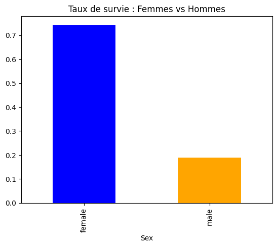
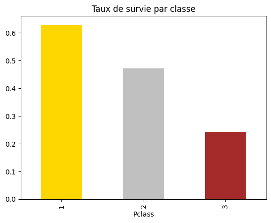

# 🚢 Analyse Titanic

Analyse exploratoire des données du célèbre dataset Titanic.

## 📊 Visualisations

### Morts vs Survivants

.png)

### Taux de survie : Femmes vs Hommes

### Taux de survie par classe

## 🛠️ Technologies utilisées
- Python
- Pandas
- Matplotlib

## 👤 Auteur
**Chaouch Anouar** — [GitHub](https://github.com/Anouar-analyst)
