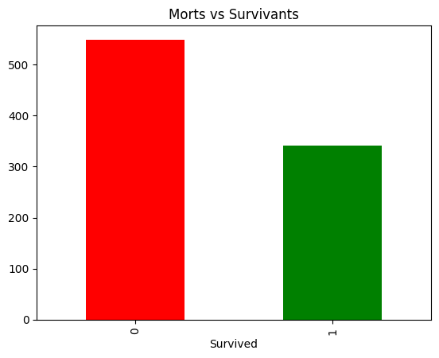

# 🚢 Analyse Titanic

Analyse exploratoire des données du célèbre dataset Titanic.

## 📊 Visualisations

### Morts vs Survivants

### Taux de survie : Femmes vs Hommes

### Taux de survie par classe

## 🛠️ Technologies utilisées
- Python
- Pandas
- Matplotlib

## 👤 Auteur
**Chaouch Anouar** — [GitHub](https://github.com/Anouar-analyst)
# 🚢 Analyse Titanic

Analyse exploratoire des données du célèbre dataset Titanic.

## 🛠️ Outils utilisés
- Python
- Pandas
- Matplotlib

## 📈 Résultats principaux
- Taux de survie global: 38%
- Femmes survivantes: 74% vs Hommes: 19%
- Classe 1 a le meilleur taux de survie

## 📂 Contenu
- `titanic_analyse.py` — Code complet
- Visualisations (PNG)
